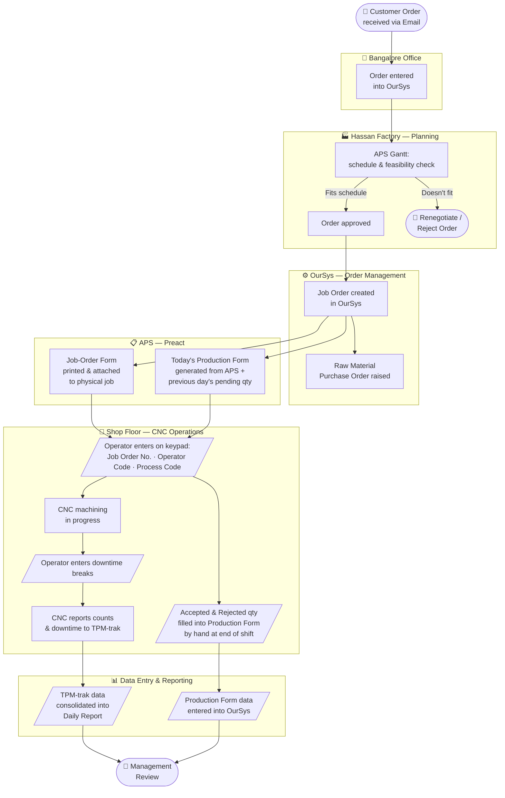

# Anomaly-detection in Factory production report

## Information flow in the factory



See samples [pictures here](https://drive.google.com/drive/folders/1_-o4STkU5P5QI7CZnIuod8hs3zJ_awhd?usp=sharing)

## Expected data-flow

1. Data entry (out of scope)
1. Factory employee exports Excel file from OpCenter: Operations by day
1. Factory employee uploads Operations by day to this tool
1. Tool triggers a download of the plan-template for the day
1. Factory employee uploads the filled-in template, along with the Daily Production Report (from TPM-Trak)
1. This tool reports the mismatches between plan and production

## Enhancements to the report

[6a] Classify the anomaly based on clustering / downtime -- pinpoint the problem

## Long-term optimization

- Productivity patterns
- Mistake patterns

## Setup

Install [uv](https://pypi.org/project/uv/) on the host

Install python dependencies:

```bash
uv sync
```

## Running the Code

Run the command in your terminal and open the link displayed in your browser 
```bash
uv run streamlit run app.py
```
